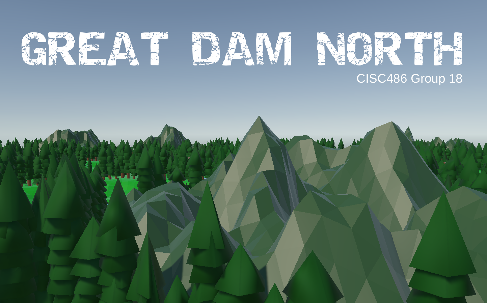
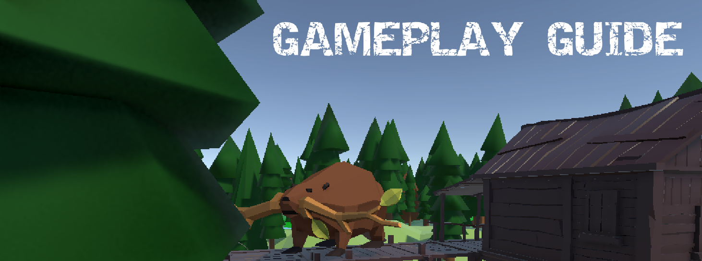

# Great Dam North - Assignment 4 (Networking)

This assignment expands on the generated world from A3 by allowing multiple players within a single game session, competing with each other for higher score. Additionally, the game itself and all essential play mechanics have been implemented.

 

## Execution Instructions
- The unity scene to load to view the game scene is ???
- Instructions for multiplayer loading?

 

## Demo Video
[video link] (need to put here)

 

## CISC 486 Group 18
- Owen Meima (21owm1)
- Gabriel Lemieux (19gml2)
- Charlie Kevill (21cmk11)

  

 

## World Map Generation

#### Procedural Hexagonal World

- World is procedurally generated using a base hexagonal tile template
- Map is divided into six regions with their own river system
- The river system connects the tiles in a region together
- Each region connects to others via a number of roads
- A syrup farm spawns at starting point of each river system
- Beavers spawn in their own syrup farm at game start

 

## Gameplay Mechanics

The core gameplay involves you playing as a beaver who wants to export his farmed maple syrup to as much of the forest as possible. You have the ability to build a variety of structures to help you in this task. Below is a detailed list of all core mechanisms which exist in the core gameplay.

#### Chewable Trees

- Beavers chew (brown) trees to collect branches.
- Beavers must be holding a branch to build structures.

#### Beaver Dam

- Beavers can build dams using branches on any river section between two tiles.
- Beavers can obtain branches by dismantling a dam.
- Dams raise the water level of the upstream river, flooding tiles.

#### Beaver Mound

- Beavers can build mounds using branches on any road between two tiles.
- Beavers can obtain branches by dismantling a mound.
- The beaver who built a specific mound will 'own' in until it is dismantled.

#### Beaver Lodge

- Beavers can build lodges using branches in any tile that is at least partially flooded.
- Lodges will be automatically dismantled with no refund, if their tile stops being flooded.
- The beaver who built a specific lodge will 'own' in until it is dismantled.

#### Syrup Farm

- Each beaver spawns at a home maple syrup farm which they 'own'.
- Syrup farms will push syrup exports along roads and rivers towards lodges of the same owner.

#### Trade Route

- Maple syrup exports from a farm will travel along trade routes, those being the **shortest** possible path towards each lodge of the same owner beaver.
- Exports may travel along rivers in the direct of current (outward from that river's syrup farm), or along roads in either direction.
- Exports from a farm may only travel along roads which have a mound of the same owner. That is, if Beaver #1 has built a mound on a certain road, then only they may push exports along it. If no mounds exist on a road, no beavers may push exports along it.
- These travel paths may **not** include opponent lodges. That is, an opponent lodge will block a beaver's trade route until it is dismantled.
- No trade route may be a complete subset of another trade route. If a line of lodges 

#### Trade Scoring

- Every several seconds, each beaver will gain 1 point for each tile along at least one of their own trade routes. For example, if Beaver #1 has 3 trades routes collectively covering 5 tiles, and Beaver #2 has one trade route collectively covering 6 tiles, then each beaver will gain 5 and 6 points, respectively.
- Trade scoring may only increment. Trade scoring does not end at any time and the player(s) may choose when to consider a round over/won.

 

## AI System

The AI System implemented in A3 has been preserved during the implementation of the multiplayer framework. A link to the README of that assignment, which described all FSM states/transitions and other AI components, may be accessed with the link below.

[View Assignment 3 README](PreviousAssignments/A3_README.md)

 

## Controls

#### Player Controls

- **WASD** - Move beaver (movement is relative to camera orientation)
- **C** - Chew tree, dam, or mound
- **E** - Build dam, mound, or lodge (requires holding a branch)
- **Space** - When near a dam to jump over it

#### Camera Controls

- **Mouse** - Pan camera around the scene
- **Mouse Scroll** - Zoom in/out
